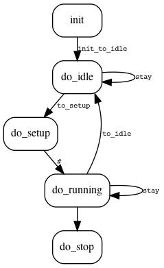

# GV_FSM [](https://badge.fury.io/rb/gv_fsm)

This is a Ruby gem and executable for generating a stub for a Finite State Machine in C/C++ from a scheme written in Graphviz language.

Curent version is very preliminary, but working.

## Usage

First, you have to create a Graphviz .dot file describing the state machine. Use directed edges for transition and follow these conventions:

* States are represented by nodes. Node labels are taken as name of functions called within a state.
* If the state label is missing, the function is fenerated with the signature `state_t do_<statename>(void *data)`
* All persistent state data have to be put in the `data` object (typically a C struct)
* Transitions may have associated functions: if an edge (transition) label is missing, no transition function is generated. If it is present, then the label becomes the name of the function; if the lable is the `#` character, the function is generated with the signature `void <source_state>_to_<dest_state>()`
  
The .dot file can be used for generating C/C++ files with the command:

```sh
gv_fsm scheme.dot
```

This generates a header file (by default with the name `scheme.h`, use the `-s` switch for changing it) and the source file (`scheme.c`). Typically, **you have then to provide the implementation of state and transition functions by only editing the `scheme.c` file**.

The main interface to the FSM in C is the `run_state` function. See at the end of the generated source file for example usage.

## Example

See the `sm.dot` file as FSM example, and the generated files `example.{c,h}`. In this example, the same function `stay` is generated from both transitions from idle to idle and from running to running. Also, the name of the transition from setup to running is automatically generated (as `setup_to_running`).


